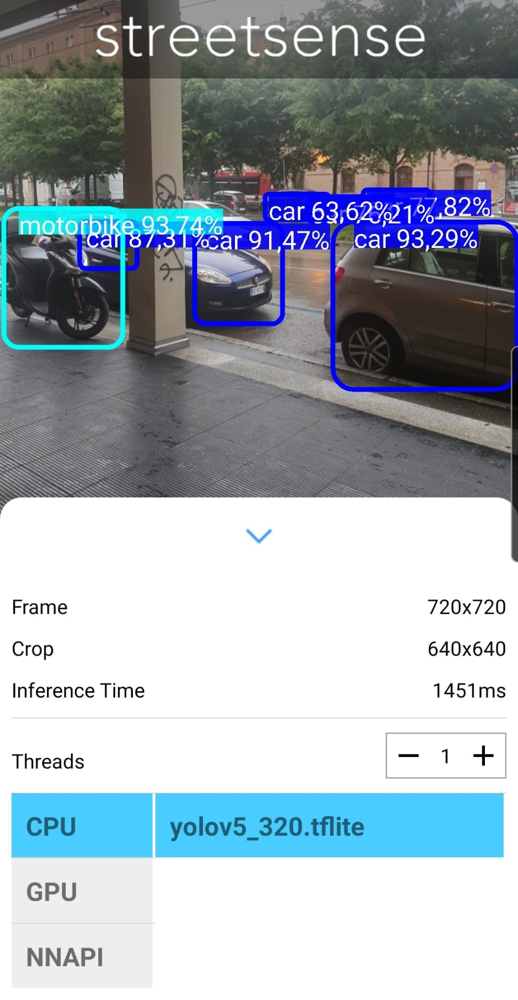
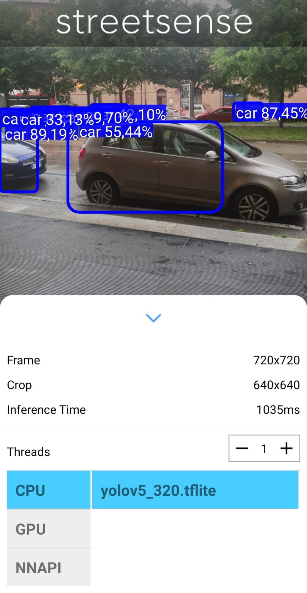

# streetsense
## Training the neural network
YOLOv5 was used to train the neural network (from https://github.com/ultralytics/yolov5/tree/master/data), running the train.py file like this:
```
python yolov5\train.py --img 640 --cfg yolov5s.yaml --hyp hyp.scratch.yaml --batch 32 --epochs 100 --data road_sign_data.yaml --weights yolov5\runs\train\trained_50\weights\best.pt --workers 24 --name trained_150
```
where:
- **img**: output image size;
- **cfg**: model configuration;
- **hyp**: configuration file containing hyperparameters for training the YOLOv5 model;
- **batch**: batch size;
- **epochs**: number of epochs;
- **data**: path to the yaml file;
- **weights**: custom path for weights;

Converting a PyTorch model (.pt) to Tensorflow Lite (.tflite) typically requires a series of intermediate steps: One of the common steps is to convert the model from PyTorch to TensorFlow SavedModel (.pb), which can then be converted to TensorFlow Lite.

To obtain a file in “.tflite” format, we first used the "export.py" script to export it first in “.pb” format:
```
python export.py --weights runs/train/trained_150/weights/best.pt --include pb
```
where:
- **weights**: specifies the path to the model weights file you want to export;
- **include**: Specifies the formats in which the model will be exported.

After obtaining the file in ".pb" format, the "tflite_convert" command from the tensorflow library was executed to convert the latter into the desired format:
```
tflite_convert --saved_model_dir runs/train/trained_150/weights/best_saved_model --output_file model.tflite
```
where:
- saved_model_dir: Specifies the directory that contains the TensorFlow model saved in the SavedModel format.
- output_file: Specifies the path and name of the output file for the converted model.

## Structure
Our starting point was the structure of an Android application that uses a TFLite model for real-time object detection using streaming from the camera. In this architecture (https://github.com/AarohiSingla/TFLite-Object-DetectionAndroid-App-Tutorial-Using-YOLOv5/tree/main), we imported our TFLite model, modified some parameters to adapt it to our network and used the .xml file present in the assets directory as the "skeleton" of our layout to be presented to the user.

## Deployment
The deployment was done on different physical devices with different Android versions in order to test their functioning. It was done on Xiaomi 11T Android 14 version and Samsung s10e Android 10 version where both executions were successful.

<div style="display: flex; justify-content: center;">
  
  
</div>

## Future developments
The project lends itself to further future developments, such as the search for a larger and more complete dataset that could significantly improve the accuracy of the model, which would therefore allow the number of recognized vehicle categories to be expanded (e.g. bicycles, electric scooters, emergency etc.) and perhaps to differentiate between subcategories within existing classes (e.g. distinguish cars between sports cars, SUVs, and sedans).
StreetSense could be integrated with autonomous driving systems to improve traffic safety and efficiency or used to collect real-time traffic data and improve urban management.
